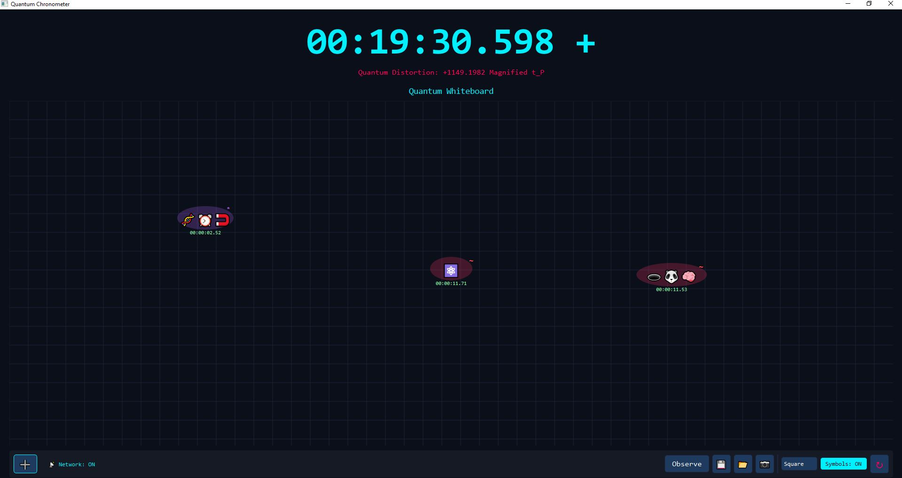

## ⚛️ Quantum Chronometer: Time Flows Only When Observed

A Python application built with PySide6 that explores quantum concepts through an interactive timekeeping experience. **Time only moves when you observe it** — move your mouse near units to make time flow!

---

## 🌟 Key Features

| Feature | Description |
|---------|-------------|
| **Observation-Based Time** | Time only flows when you move your mouse (proximity matters!) |
| **Observe Button** | Toggle continuous time flow |
| **144+ Emojis** | 8 categories with searchable emoji picker |
| **Black Hole Units** | 🕳️ creates extra time distortion |

## ⚡ Support
<div align="center">

**Made with ❤️ and ☕ by the Plantacerium**

[](https://ko-fi.com/plantacerium)

⭐ **Star us on GitHub** if the script is useful to You! ⭐
</div>

## 🌌 Quantum Mechanics (How it Works)

### Observation-Based Time
Time in the Quantum Chronometer works differently than standard wall-clock time:
1.  **Observer Effect**: Time only flows forward when you are "observing" (moving the mouse or toggling the "Observe" button). If you stop, time stops.
2.  **Proximity**: The closer your mouse is to the units, the faster time flows for them.

### Superposition Symbols
When created, each unit is assigned a random quantum state, visualized by a symbol and color:
- **+ (Cyan)**: **Positive Superposition**. Tends to flow slightly faster (+1% to +5%).
- **\* (Purple)**: **Neutral/Chaotic**. Fluctuates randomly around the standard flow (±2%).
- **~ (Red)**: **Negative Superposition**. Tends to lag slightly behind (-1% to -5%).

You can toggle the visibility of these symbols using the **"Symbols: ON/OFF"** button.

### Entanglement & Distortion
- **Movement**: Moving units creates minor time ripples.
- **Proximity**: Units placed close together (within 100px) affect each other's local time gravity.
- **Black Holes (🕳️)**: Units with this emoji create massive time distortion fields.
- **Entanglement**: Units can become entangled, sharing their distortion values.

---

## 📡 Networking (Phase 5.1)

The Quantum Chronometer now features **Local Spacetime Entanglement**!
- **Auto-Discovery**: Simply open multiple instances of the application on the same local network.
- **Shared Distortion**: Dragging a unit or creating distortion on one computer will transmit "time waves" to all other connected instances in real-time.
- **No Setup**: Uses UDP Broadcast (Port 50055). Just run and play.

---

## 🎮 Controls

- **Drag & Drop**: Move units to warp local time.
- **Right-Click**: Collapse wave function (reset local distortion).
- **Observe Button**: Toggle continuous time flow.
- **Grid Selector**: Choose between Square, Circle, or Hexagon grids.
- **Save/Load (💾/📂)**: Persist your quantum experiments.
- **Screenshot (📷)**: Capture the current state.
- **Reset (↻)**: Clear the whiteboard.
| **Unit Entanglement** | Link units to share their distortion |
| **Save/Load** | 💾 Export and 📂 import your whiteboard state |
| **Screenshot** | 📷 Capture your quantum whiteboard |

---

## 💫 Core Concepts

### 1. ⏱️ Observation-Based Time
Time only progresses when you **observe** the system:
- **Mouse movement** = observation (closer to units = faster time)
- **Observe button** = continuous time flow

### 2. 🌌 Quantum Gravity Effects
Units on the whiteboard act as point masses:
- **Proximity** between units creates time dilation
- **Movement** creates spacetime ripples

### 3. ✨ Superposition Symbols
Each unit has a symbol affecting time:

| Symbol | Effect |
|--------|--------|
| **+** | Accelerates time (cyan glow) |
| **\*** | Neutral (purple glow) |
| **~** | Decelerates time (red glow) |

### 4. 🕳️ Black Hole Unit
Type 🕳️ to create a black hole unit with +0.5 extra distortion factor!

---
## ⭐ UI Screenshot


---

## 🚀 Getting Started

### Prerequisites

```bash
pip install PySide6
```

### Run

```bash
python -m quantum_chronometer.main
```

---

## 🎮 How to Use

1. **➕ Add Unit** — Click the add button to open the emoji picker
2. **Search Emojis** — Type keywords like "atom", "star", "cat", etc.
3. **Observe Time** — Move your mouse near units to make time flow
4. **Continuous Mode** — Click **Observe** for non-stop time
5. **Save/Load** — 💾 saves your whiteboard, 📂 loads it back
6. **Screenshot** — 📷 captures the whiteboard as PNG

---

## 🛠️ Architecture

```
quantum_chronometer/
├── model.py   # Data & logic (QuantumModel, QuantumUnit)
├── view.py    # UI components (QuantumView, DraggableUnitWidget)
└── main.py    # Controller (QuantumController)
```

**24 headless tests** ensure reliability.

---

## 📝 Note

This is a conceptual abstraction for learning and fun — not an actual physics simulation. Enjoy your journey outside Newtonian time!

## ⚡ Support
<div align="center">

**Made with ❤️ and ☕ by the Plantacerium**

[](https://ko-fi.com/plantacerium)

⭐ **Star us on GitHub** if the script is useful to You! ⭐
</div>
